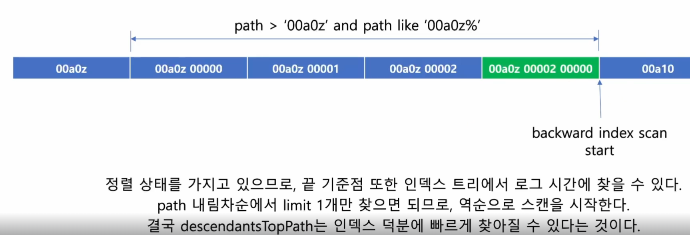

학습순서
1) article
2) comment_V1 -> comment_V2
3) like

----
<h1>게시글(ariticle)</h1>

1. 비슷한 메소드는 파라미터 갯수차이로 클라이언트에서 구분하여 요청하도록 하자

2. from, of 와 같이 팩토리 메소드를 적극사용하자.

3. 무한 스크롤은 "<=" 연산자를 이용해서 구현이 가능하다.

4. 샤드에선 pk를 auto increment 를 사용해도 유일성이 보장되지 않는다.
또한, 클라이언트에 키를 노출하게 될 경우 보안적인 이슈가 있을 수 있다.
다만, 너무 큰 문자열을 사용하게 되면 인덱스의 크기가 커지고, 검색 속도가 느려질 수 있다.
절충안인 snowflake를 사용하자.

5. Common 클래스에선 아래와 같이 정의한다.
```java
/**
 * 유틸성 클래스는 final로 선언하고, 생성자를 private으로 선언하여 인스턴스 생성을 막는다.
 */
@NoArgsConstructor(access = AccessLevel.PRIVATE)
```


---
<h1>댓글(comment)</h1>


1. 부모의 id를 참조하기 위해선 문자열로 저장해야한다. </br>
예) 123|456|789 이런식으로 저장하고, split을 통해 파싱한다.

문자열로 구분했기에 경로 컬럼이 정렬되어 있고 부모 댓글로 순서대로 자식 댓글도 정렬이 되어있어 해당 부분만 조회하기 때문에
커버링 인덱스가 사용되어 많은양의 데이터에도 빠르게 조회가 가능하다.



2. @NoArgsConstructor(access = AccessLevel.PROTECTED) 로 엔티티클래스에 생성자 생성을 제한한다.</br> 
-> 팩토리 메소드나 빌더 패턴 등 정해진 방법으로만 객체 생성 가능


3. count와 limit, 복합 인덱스가 있다면 인라인 서브쿼리를 통해 효율적으로 카운팅할 수 있다.
```sql
                    "select count(*) from (" +
                    "   select comment_id from comment " +
                    "   where article_id = :articleId and parent_comment_id = :parentCommentId " +
                    "   limit :limit" +
                    ") t"
```


---
<h1>좋아요</h1>

좋아요를 테이블에서 관리하면 레코드에 락이 잡힐 여지가 크다.
그렇다고 타임아웃과 요청량에 제한을 둔다면 정상적인 기능에 문제가 생길 여지가 크다

그래서 좋아요를 레코드에 관리하지 않고, 독립적인 테이블로 분리하여 관리한다. 

---
2025-03-04
lock 별로 테스트를 돌려보고 상황별로 어떻게 다른지 확인해보고 적절한 것을 찾아야한다.


---
<h1>조회수</h1>


----
<h1>인기 게시글</h1>
많은 데이터를 조회해야하기 때문에 캐시를 활용하여 처리한다.
----
<h1>article-reade(CQRS)</h1>


----
<h1>kafka</h1>
카프카 핵심 구조

브로커: 카프카 서버로, 메시지를 저장하고 전달하는 중간 역할을 담당
토픽: 메시지의 논리적 그룹 또는 채널, 특정 종류의 메시지를 저장하는 단위
파티션: 토픽의 물리적 분할 단위, 병렬 처리와 확장성 제공

작동 방식

프로듀서가 특정 토픽으로 메시지를 전송
각 브로커는 토픽의 일부 파티션을 관리하고 저장
컨슈머는 토픽의 파티션에서 메시지를 구독하여 읽음

파티션의 역할

파티션은 토픽 내 병렬 처리 단위
파티션이 많을수록 해당 토픽에 대한 처리량(throughput) 증가
파티션 수는 해당 토픽에 대한 병렬 처리 가능 정도를 결정

브로커와 파티션 관계

하나의 브로커는 여러 토픽의 여러 파티션을 호스팅
하나의 토픽의 파티션들은 여러 브로커에 분산됨
각 파티션에는 리더와 복제본이 있어 고가용성 제공